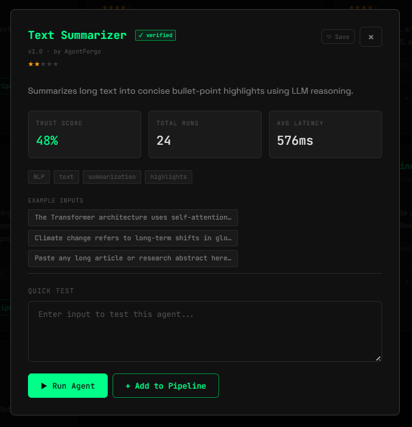
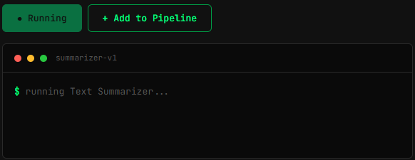
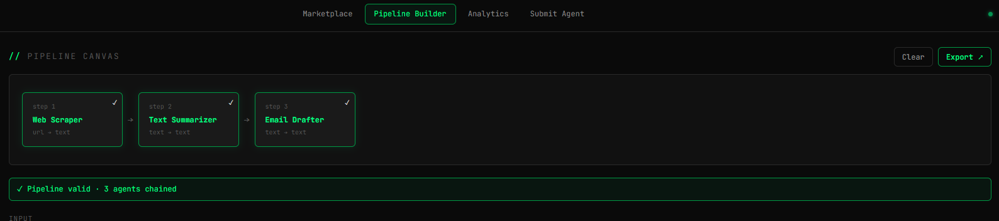
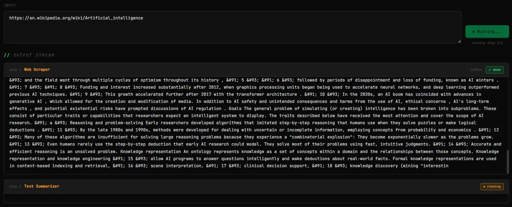
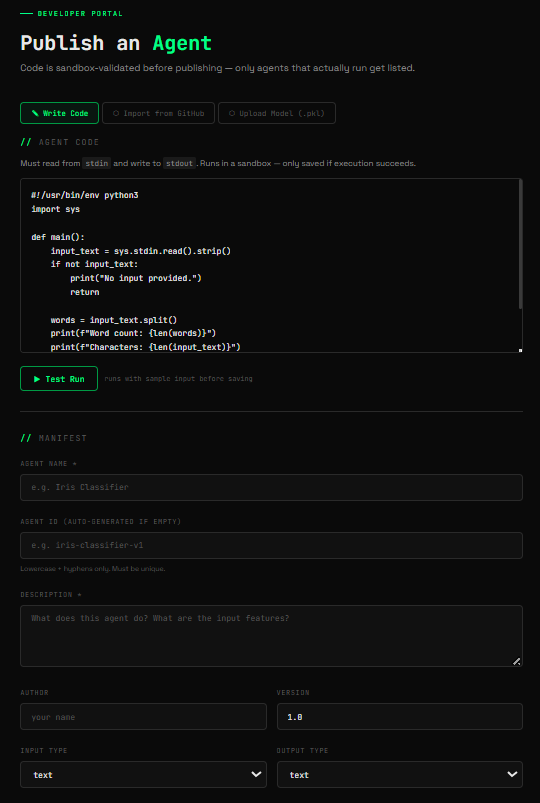
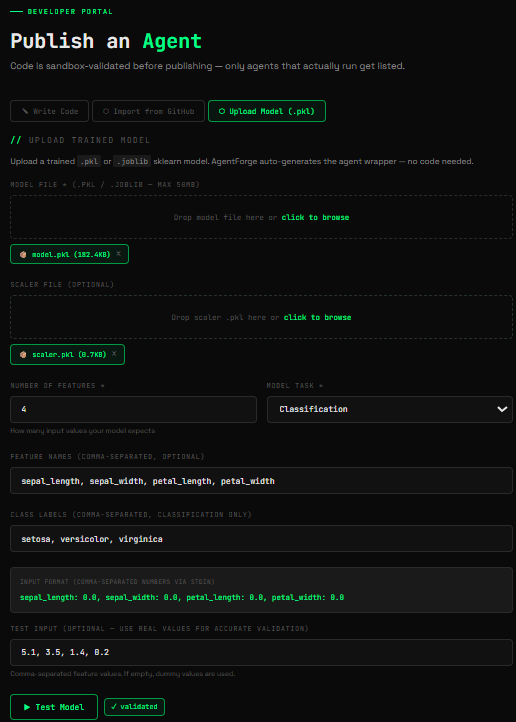
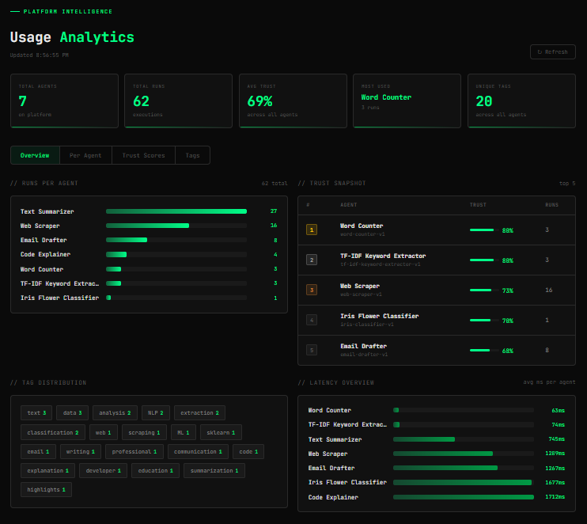
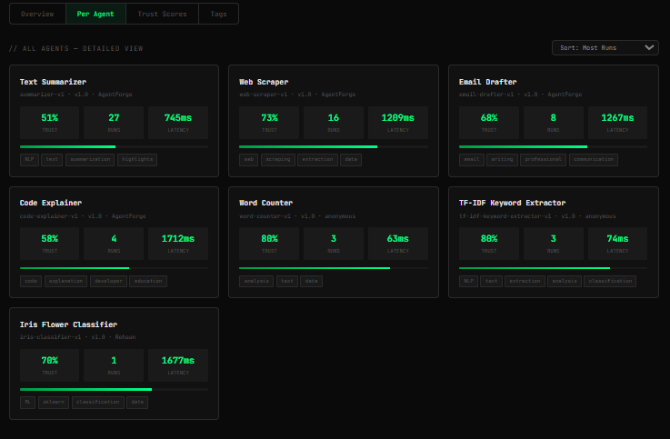
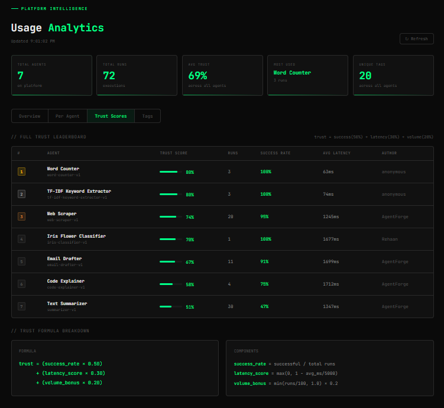
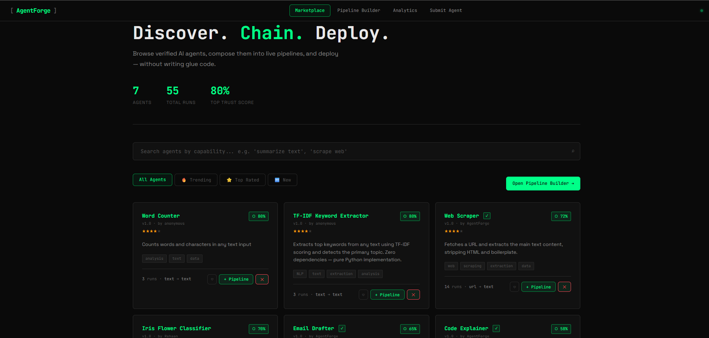

# AgentForge

**A composable AI agent marketplace with live sandboxed execution.**

AgentForge is not just a directory of AI agents — every agent listed here has actually been run and verified before it appears. You can test any agent directly in the browser, chain multiple agents together into automated pipelines, and publish your own agents (with code or a trained ML model) through a developer portal. No Docker, no complex setup, all free tier.

Built for **HackIndia Spark 6 — NIT Delhi** by **Team Sigmoid**.

> Track: AI Agents Marketplace

---

## What problem does this solve?

The AI agent ecosystem right now has three big problems:

1. **No discoverability** — thousands of agents exist scattered across GitHub repos, HuggingFace, and personal projects. There is no central place to search, compare, or evaluate them side by side.

2. **No verification** — agents are listed or published but never actually tested. You have no way to know if an agent works until you try to run it yourself, which takes time and setup.

3. **No composability** — every agent is a silo. There is no standard way to connect Agent A's output to Agent B's input, or chain multiple agents into a workflow without writing custom glue code.

AgentForge fixes all three.

---

## Live Demo

```
http://localhost:8080
```

```
git clone https://github.com/HackIndiaXYZ/hackindia-spark-6-ncr-central-region-sigmoid
cd hackindia-spark-6-ncr-central-region-sigmoid
pip install -r requirements.txt
cp .env.example .env   # add your GROQ_API_KEY
python run.py
```

Get a free Groq API key at [console.groq.com](https://console.groq.com) — takes 2 minutes. Without it, agents fall back to rule-based output and still work for demo purposes.

---

## Screenshots

### Marketplace — Discover & Search



The main marketplace shows all registered agents as cards. Each card displays the agent name, author, version, a star rating (mapped from the trust score), capability tags, run count, and the input/output types. There are four tabs at the top — All Agents, Trending (sorted by most runs), Top Rated (sorted by trust score), and New (user-submitted agents float to the top). The search bar uses ChromaDB semantic search, which means you can search by what you want to do ("summarize text", "classify data") and it will find relevant agents even if your exact words don't appear in the agent name.

---

### Agent Detail Modal — Trust Metrics & Live Test



Clicking any agent card opens a detail modal. This shows the trust score, total run count, average latency in milliseconds, and tags. Below that are example input chips — clicking one loads it into the test box. The Quick Test section lets you run the agent right there in the browser. Output streams in real time in a terminal-style UI.

---

### Live Agent Execution — SSE Streaming Terminal



When you hit Run Agent, the request goes to FastAPI which hands it off to the Executor. The Executor spawns an isolated subprocess running the agent's Python script. Output is streamed back chunk by chunk using Server-Sent Events (SSE) and displayed in the terminal as it arrives. This is not a fake animation — the output you see is the actual stdout of the process, streamed live.

---

### Pipeline Builder — Chain Agents Visually



The pipeline builder lets you drag agents onto a canvas and connect them in sequence. The system validates input/output type compatibility automatically — for example, the Web Scraper outputs `text` and the Text Summarizer expects `text`, so they chain cleanly. The validation bar at the bottom confirms the chain is valid and shows how many agents are connected.

---

### Pipeline Running — Multi-Step SSE Stream



When you run a pipeline, each agent executes in order. The output from step 1 becomes the input to step 2, and so on. Each step has a status badge that shows `running`, then `✓ done` with the latency in milliseconds once complete. The full output of each step streams in real time in its own section. In this example, the Web Scraper fetched the Wikipedia page for Artificial Intelligence (step 1 done in 1109ms), and the Text Summarizer is processing the extracted text (step 2 running).

---

### Developer Portal — Publish with Code



The developer portal has three ways to publish an agent. The Write Code tab gives you a code editor right in the browser. You write your agent (it must read from stdin and write to stdout), click Test Run, and the backend saves it to a temp file and runs it in a sandbox subprocess. If it crashes, produces no output, or times out (15 seconds), it is rejected. Only if it passes does the Publish button unlock. You also fill in a manifest with the agent name, description, tags, and I/O types.

---

### Developer Portal — Upload Trained ML Model



The Upload Model tab lets you publish a trained sklearn model without writing any code. You upload a `.pkl` or `.joblib` file, optionally a scaler file, specify the number of features, feature names, class labels, and a test input. AgentForge automatically generates a Python wrapper agent that loads your model, parses comma-separated input from stdin, applies the scaler if provided, runs `.predict()` and `.predict_proba()`, and prints a formatted prediction report. The generated agent is then sandbox-tested before saving.

---

### Analytics — Overview Dashboard



The analytics page has four tabs. The Overview tab shows a horizontal bar chart of runs per agent, a trust score snapshot of the top 5 agents, a tag distribution cloud, and a latency overview chart showing average response time per agent. Everything updates in real time from the database. The KPI strip at the top shows total agents, total runs, average trust score, most used agent, and number of unique tags across the platform.

---

### Analytics — Per Agent Detail View



The Per Agent tab shows a card for every registered agent with its trust score, run count, and average latency. You can sort by most runs, trust score, lowest latency, or name. Each card also shows the agent's tags and a trust bar so you can visually compare agents at a glance.

---

### Analytics — Full Trust Leaderboard



The Trust Scores tab shows the full leaderboard with gold, silver, and bronze rank badges. Columns include trust score with a mini bar, total runs, success rate, average latency, and author. The formula breakdown at the bottom explains exactly how the trust score is computed.

---

## How the Trust Score Works

Trust score is a number between 0 and 1 that represents how reliable an agent is. It is computed automatically after every execution:

```
trust = (success_rate × 0.50)
      + (latency_score × 0.30)
      + (volume_bonus  × 0.20)
```

- **success_rate** — ratio of successful runs to total runs. An agent that crashes or times out gets penalized here.
- **latency_score** — `max(0, 1 - avg_ms / 5000)`. An agent that responds in under a second scores close to 1. An agent that takes 5 seconds scores 0.
- **volume_bonus** — `min(runs / 100, 1.0) × 0.2`. Agents with more usage get a small credibility bump, capped at 100 runs.

New agents start at 0.7 (70%) and the score updates after every single run.

---

## Architecture

```
Browser (Vanilla JS + SSE)
        ↓
FastAPI + Uvicorn  (Python 3.10)
        ↓
┌──────────────────────────────────────────┐
│  Registry (SQLite)   Search (ChromaDB)   │
│  Trust Engine        Pipeline Validator  │
└──────────────────────────────────────────┘
        ↓
Executor (ThreadPoolExecutor — Windows safe)
        ↓
subprocess (isolated Python process)
        ↓
Agent (stdin → stdout protocol)
```

### Component breakdown

**FastAPI + Uvicorn** — the web framework serving all routes. REST endpoints for agent CRUD, search, pipeline operations, and file uploads. SSE endpoints (`text/event-stream`) for streaming agent output back to the browser in real time.

**SQLite (via db.py and registry.py)** — stores all agent metadata: id, name, description, author, version, tags, input/output types, trust score, run count, average latency, and success count. Lightweight, zero-config, file-based. All agent manifests are also saved as JSON files on disk.

**ChromaDB (via search.py)** — a vector database for semantic search. When an agent is registered, its name, description, and tags are embedded and stored in ChromaDB. When you search "extract keywords from text", ChromaDB finds the most semantically relevant agents even if your words don't exactly match. Falls back to basic substring search if ChromaDB is unavailable.

**Executor (executor.py)** — the most critical component. On Windows, `asyncio.create_subprocess_exec` breaks with uvicorn's event loop. The fix: agents run via `subprocess.run()` inside a `ThreadPoolExecutor`, then wrapped in `loop.run_in_executor()` to avoid blocking the async event loop. This is what makes everything work on Windows without Docker. Each agent gets its own isolated subprocess with a 30-second timeout and its own stdin/stdout pipes.

**Agent Standard** — every agent follows the same contract: read input from `sys.stdin`, process it, print output to `sys.stdout`. This means any agent can pipe into any other agent — the pipeline composer just passes stdout of step N as stdin to step N+1.

**Trust Engine (trust.py)** — called after every execution. Reads the current stats from SQLite, recalculates the trust formula, and writes the new score back. Runs synchronously after each agent subprocess completes.

**Pipeline (pipeline.py)** — validates that input/output types of adjacent agents are compatible before allowing a run. Also builds the ordered execution plan. The LangGraph exporter (exporter.py) converts any pipeline into a LangGraph-compatible JSON spec that can be used outside AgentForge.

**Server-Sent Events (SSE)** — instead of WebSockets, AgentForge uses SSE for streaming. The browser opens a one-way stream connection and the server pushes JSON events: `step_start`, `token` (chunks of output), `step_done` (with latency), and `pipeline_done`. SSE is simpler than WebSockets for this use case since we only need server-to-client streaming.

**Frontend** — pure vanilla HTML, CSS, and JavaScript. No React, no build step. Three pages: `index.html` (marketplace), `builder.html` (pipeline composer), `submit.html` (developer portal). Plus `analytics.html`. Uses `sessionStorage` to persist the pipeline between page navigations.

---

## Agent Submission Flow

There are three ways to publish an agent:

### 1. Write Code (browser editor)
Write Python directly in the browser. Click Test Run — the code is saved to a temp file and executed in a sandbox. If it passes (exit code 0, non-empty stdout), the Publish button unlocks. On publish, the code is re-validated, saved to `agents/<folder>/agent.py`, and the executor map is updated at runtime — no server restart needed.

### 2. Import from GitHub
Paste a `raw.githubusercontent.com` URL. The backend fetches the file with httpx, loads it into the code editor, and you go through the same Test Run → Publish flow.

### 3. Upload Trained Model (.pkl / .joblib)
Upload a trained sklearn model and optional scaler. Specify feature count, feature names, class labels, and a real test input. AgentForge generates the full agent.py wrapper automatically, sandbox-tests it with your test input, and publishes it. The model and scaler files are saved alongside the generated agent.py. The agent description on the marketplace shows the input format so users know exactly what to send.

---

## Demo Agents

| Agent | Description | Input | Output |
|---|---|---|---|
| **Text Summarizer** | Summarizes long text into bullet points using Groq llama-3.1-8b | text | text |
| **Code Explainer** | Explains code line by line in plain English using Groq | code | text |
| **Web Scraper** | Fetches a URL and extracts the main text content, strips HTML | url | text |
| **Email Drafter** | Drafts a professional email from any text or summary using Groq | text | text |

---

## Tech Stack

| Layer | Technology |
|---|---|
| Backend | FastAPI, Uvicorn, Python 3.10 |
| Database | SQLite (agent registry + execution logs) |
| Vector Search | ChromaDB |
| LLM | Groq API — llama-3.1-8b-instant |
| Sandbox | subprocess + ThreadPoolExecutor |
| Streaming | Server-Sent Events (SSE) |
| HTTP Client | httpx (GitHub import) |
| Frontend | Vanilla HTML / CSS / JS |
| Fonts | JetBrains Mono, Consolas |
| Pipeline Export | LangGraph JSON spec |
| ML Models | scikit-learn, joblib |

All free tier. No Docker required. Runs on Windows, Linux, and Mac.

---

## Project Structure

```
agentforge/
├── backend/
│   ├── main.py          ← FastAPI app, all routes
│   ├── executor.py      ← Subprocess sandbox + SSE streaming
│   ├── registry.py      ← Agent CRUD + SQLite
│   ├── search.py        ← ChromaDB semantic search
│   ├── trust.py         ← Trust score engine
│   ├── pipeline.py      ← Validation + execution planner
│   ├── exporter.py      ← LangGraph JSON export
│   └── db.py            ← SQLite init + schema
├── agents/
│   ├── summarizer/
│   ├── code_explainer/
│   ├── web_scraper/
│   └── email_drafter/
├── frontend/
│   ├── index.html       ← Marketplace
│   ├── builder.html     ← Pipeline composer
│   ├── submit.html      ← Developer portal
│   ├── analytics.html   ← Analytics dashboard
│   └── static/
│       └── style.css
├── data/
│   ├── agentforge.db    ← SQLite (auto-created)
│   └── chroma/          ← ChromaDB (auto-created)
├── run.py               ← Entry point (port 8080)
└── requirements.txt
```

---

## API Routes

```
GET  /                          → Marketplace
GET  /builder                   → Pipeline builder
GET  /submit                    → Developer portal
GET  /analytics                 → Analytics dashboard

GET  /api/agents                → List all agents (trust-ranked)
GET  /api/agents/{id}           → Single agent detail
POST /api/agents/submit         → Register manifest only
POST /api/agents/submit-with-code   → Validate + save code + register
POST /api/agents/submit-with-model  → Upload pkl + auto-generate wrapper
POST /api/agents/validate-code  → Sandbox test without saving
POST /api/agents/validate-model → Test pkl model without saving
POST /api/agents/fetch-github   → Fetch agent.py from GitHub URL
DELETE /api/agents/{id}         → Remove agent from marketplace + disk
GET  /api/search?q=             → Semantic search (ChromaDB)
GET  /api/stats                 → Platform stats
GET  /api/analytics             → Extended per-agent analytics

POST /api/pipeline/validate     → Check I/O compatibility
POST /api/pipeline/run          → Run pipeline (SSE stream)
POST /api/pipeline/export       → Export as LangGraph JSON

POST /api/agent/run             → Run single agent (SSE stream)
GET  /api/health                → Health check
```

---

## Team

**Team Sigmoid** — HackIndia Spark 6, NIT Delhi, April 18–19, 2026
